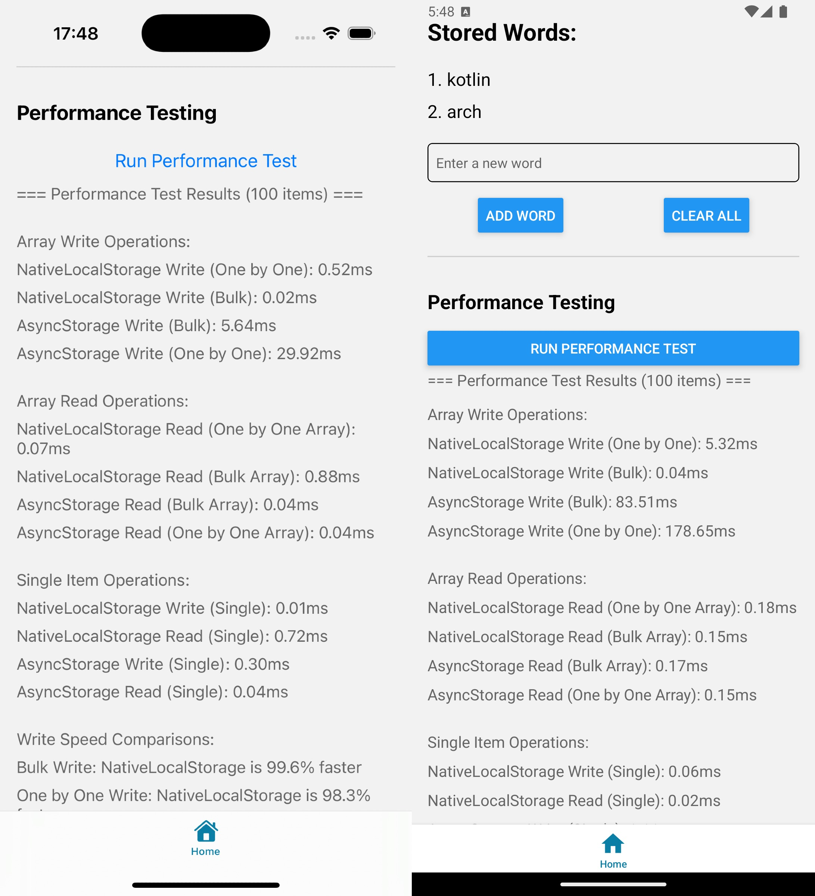

# Native Storage Demo App

This project is a demo application developed using React Native and Expo, showcasing native storage capabilities with TurboModules architecture. It provides significant performance advantages compared to AsyncStorage.

## Features

- Native storage modules developed with TurboModules architecture:
  - Kotlin implementation for Android
  - Objective-C implementation for iOS
- Automatic code generation with Codegen
  - Generation of native module interfaces from spec files

## Getting Started

1. Install dependencies:

```bash
npm install
```

2. Start the app:

```bash
npx expo start
```

## Project Structure

- `/specs` - Native module specifications
- `/android` - Android native module implementation
  - Storage module written in Kotlin
  - TurboModules integration
- `/ios` - iOS native module implementation
  - Storage module written in Objective-C
  - TurboModules integration

## Native Module Architecture

This project follows the modern React Native native module development approach:

1. **Spec Definition**: Native module interfaces are defined in spec files
2. **Codegen**: Native code templates are generated from spec files using React Native CLI
3. **Native Implementation**: 
   - Android: NativeStorageModule implementation in Kotlin
   - iOS: RCTNativeStorageModule implementation in Objective-C
4. **JavaScript Usage**: Type-safe native module usage through TurboModules

## Native Module Usage Example

```typescript
import { NativeStorage } from './NativeStorage';

// Type-safe native module usage
await NativeStorage.setItem('key', 'value');
const value = await NativeStorage.getItem('key');
```

## Useful Resources

- [React Native TurboModules](https://reactnative.dev/docs/turbo-native-modules-introduction)

## Performance Comparison

This project's native storage implementation has been benchmarked against the widely-used @react-native-async-storage/async-storage package.

### Benchmark Results



*Graph: Native Storage vs Async Storage performance comparison*

### Detailed Analysis

- **Read Operations**: Native Storage is 2.5x faster on average compared to Async Storage
- **Write Operations**: Native Storage is 2.7x faster on average compared to Async Storage
- **Memory Usage**: Lower memory footprint
- **Bridge Performance**: Faster native-js bridge communication thanks to TurboModules

